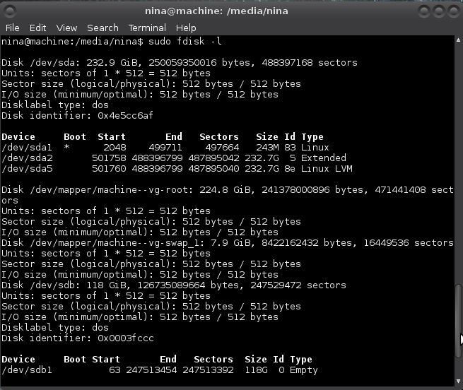
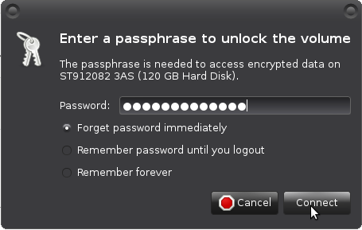

# Using cryptsetup

[Cryptsetup](https://gitlab.com/cryptsetup/cryptsetup) is a utility used to setup disk encryption based the on `dm-crypt` kernel module. LUKS (Linux Unified Key Setup) is the standard for Linux hard disk encryption, facilitating compatibility among distributions, and providing secure management of multiple user passwords.

## Installing cryptsetup

As root (on debian and its derivatives):

    # apt-get install cryptsetup

## Find drive

    # fdisk -l

Example:



It has found `/dev/sdb1`, my external drive.

## Wipe drive

If it is a new drive there was no previous sensitive data on it. If it is a disk that contained an encrypted volume, previous sensitive data is encrypted and sensitive data is not directly readable. In both cases you can continue with creating an encrypted volume

If you previously had unencrypted sensitive data on the drive, you need to do something to obscure that data. Deleting it is not enough. Drives can be wiped with `dd` which overwrites it with zeros (quick) or random data (more secure, but it takes a whole night for example for a 120G drive). You can overwrite a partition, or overwrite the entire drive (you will have to repartition the drive afterward). 

To overwrite an entire drive, leave off the partition number of the device name (that you found with fdisk) in one of the following `dd` commands (use output file `of=/dev/sd*` instead of `/dev/sd*1`).

    # dd if=/dev/zero of=/dev/sdb1
or
    # dd if=/dev/urandom of=/dev/sdb1

## Create encrypted volume

    # cryptsetup luksFormat /dev/sdb1

Enter a passphrase when asked.

Open the encrypted volume:

    # cryptsetup luksOpen /dev/sdb1 <name>

Where `<name>` is a temporary name you pick (no special characters or spaces). Closing the volume removes the name.
Creating filesystem

For creating an `ext4` filesystem:

    # mke2fs -t ext4 /dev/mapper/<name>

Use `ext2` for a small drive. 

##  Mount drive

If your partition has no label, it will be mounted in `/media/UUID`, where `UUID` refers to the `UUID` of the partition.

For mounting linux drives:
    
    # mount /dev/mapper/<name> /mnt

`/mnt` can be any mount point you choose. 

## Own it

    # chown -R [user] /mnt

Where `[user]` is your user name.

## Unmount drive

Unmount drive and close the encrypted volume:

```
# umount /mnt
# cryptsetup luksClose <name>
```

## Using drive 




