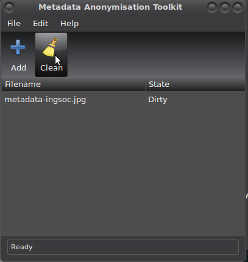

# Metadata Anonymisation Toolkit (MAT)

[MAT](https://gitweb.torproject.org/user/jvoisin/mat.git/) is a toolbox composed of a GUI application, a CLI application and a library, to anonymize/remove metadata. 

[mat2](https://0xacab.org/jvoisin/mat2) provides a command line tool, and graphical user interfaces via a service
menu for Dolphin, the default file manager of KDE, and an extension for Nautilus, the default file manager of GNOME. It is currently in beta, please don't use it for anything critical.

A word of warning:

Mat only removes metadata from files, it does not anonymise their content, nor can it handle watermarking, steganography, and not all formats are supported.

If you really want anonymity, use a format that does not contain any metadata, or better yet, use plain text.

