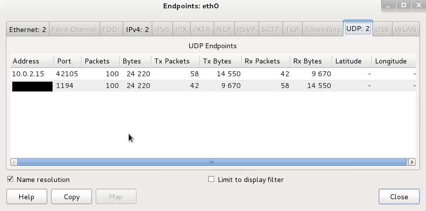

# DNS leaks

When you don’t set up DNS servers on your computer or router, your DNS queries will run on your ISP’s DNS servers. Without VPN (or [VPN Fails Open](VPN-fail-open.md)), DNS requests are most likely sent unencrypted, which can lead to many different types of common DNS attacks. 

* Domain hijacking (Redirection)
* DNS flood attack (a type of DDoS attack) 
* DNS spoofing or DNS cache poisoning
* DNS hijacking (malware infection on a local device to hijack DNS to redirect traffic to a phishing site)

And any man in the middle of your traffic can see your online behaviour and the websites you visit. Your ISP’s DNS servers see every search you make in your browser. 

Using your ISP’s DNS servers as default DNS servers doesn’t do anything for security or privacy.

## Use wireshark to check for leaks 

This is an example in a debian virtualbox VM, but is also valid in general for other setups.

Virtual machines receive their network address and configuration on the private network from a DHCP server integrated into VirtualBox. The IP address assigned to the virtual machine is on a completely different network than the host (but can be seen with Traffic monitoring from the host). As more than one card of a virtual machine can be set up to use Network address translation (NAT), the first card is connected to the private network 10.0.2.0, the second card to the network 10.0.3.0 and so on.

To check if you have DNS leaks, fire up wireshark:

  * Start capturing on eth0 and connect to the VPN.
  * After capturing either a fixed number of packets, or an amount of data or for a specific time period, go to //Statistics -> Endpoints//

There should only be one public IP address, namely that of the VPN server that you’re connected to. The ''10.0.2.15'' in this image is a local address.

## Choosing alternative DNS servers

* [OpenNIC](https://www.opennic.org/) is a group of volunteers who run an alternate DNS network offering free DNS servers. Depending on your location, you are offered different servers. OpenNIC offers DNS neutrality (it does not censor content), and you get the right to choose how much data OpenNIC logs.
* [OpenDNS](https://www.opendns.com) is a cloud-based service offering three solutions in their Home package, two of which are free. To connect with your nearest DNS server, and for faster page load times, it uses anycast routing.
* [DNSWatch](https://dns.watch/) also offers DNS neutrality and does not log any DNS queries or record history.
* [Quad9 DNS](https://www.quad9.net/) blocks malicious and suspicious domains using security intelligence from a group of  companies to improve security. They do keep logs on some activity.

