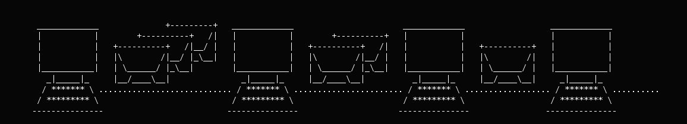

# Digital mixing

In the eighties, digital mixes (sometimes called mix networks or mixnets) to achieve a higher level of anonymity with personal communication appeared. Digital mixing uses a similar system as routing, but it adds several layers in the connection between the sender and receiver of the communication. The layers are created using public key cryptography. Using digital mixing is comparable to sending a letter encased in four envelopes pre-addressed and pre-stamped with a small message reading, please remove this envelope and repost.

Note: Mixnets are not designed to disguise the fact that you are using a mix network. If an adversary can simply lock you up for using anonymity tools, you need to disguise your use of anonymity tools.

If Alice wants to send a message to Bob, without a third person being able to find out who the sender or recipient is, she would encrypt her message three times with the aid of public key cryptography. She would then send her message to a proxy server who would remove the first layer of encryption and send it to a second proxy server through the use of permutation. This second server would then decrypt and also permute the message and the third server would decrypt and send the message to the intended recipient.

## Threshold batching 

A mix node must collect more than one message before sending any out - otherwise the node is behaving as an onion router node with a time delay. The more messages collected, the more uncertainty is introduced as to which message went where. Using this threshold batching strategy to solve a lack of messages can make the period between the sending and the eventual receiving of the message long, like several hours, depending on the amount of messages deemed critical.

This system is thought effective because as long as the three successive recipients, the re-senders, send enough messages to different mixnodes it is impossible for a third person like an ISP (and government (law enforcement) agencies) to find out what message was originally sent by whom and to whom. Mixing is specifically designed to provide security even if an adversary can see the entire path.

## Vulnerabilities 

* Only works if the resenders send enough messages (at any given moment and during a set amount of time). Because (most) nodes, the resending servers, do not send enough messages at the same time, digital mixing could be vulnerable to statistical analysis such as data mining by governments or government policing and intelligence agencies.
* The use of public key cryptography in itself is not very fast, and has its own vulnerabilities. 

 
